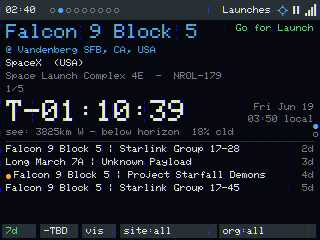
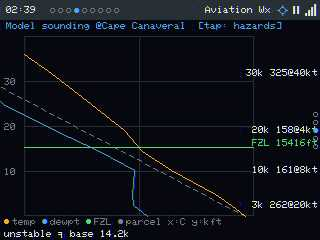

# Overhead

**An air-&-space situational-awareness dashboard for a $10 touchscreen — the sky, on your desk, updating in real time.**

*Above: a saved **memory sky** — the exact sky over Hopkinsville, KY at 18:25 UTC on 21 Aug 2017, the moment of greatest eclipse, with the Sun, Regulus and the planets strung along the ecliptic, recreated on the device.*

---

## What is this?

**Overhead** turns a cheap ESP32 "Cheap Yellow Display" (CYD) into a glanceable
observation deck for everything happening above you — **right now, from where you
are.** Satellites passing overhead, rockets about to launch, aircraft on approach,
aviation and space weather, the solar system, a live all-sky star map, and a
"tonight at a glance" agenda — all on a $10–15 touchscreen you can leave on a shelf.

It knows your location and the time, and an **Intelligent Focus** director quietly
surfaces the one thing worth looking at across all of those tabs: an ISS pass in
four minutes, a launch window opening, a geomagnetic storm, a thunderstorm rolling in.

### The heart of it

Beyond being the best little air-&-space *desk clock*, Overhead exists to **inspire
kids**. It puts the awe of far-away missions on a child's bedside table and makes it
*real*: space stops being abstract and becomes "look — the ISS goes over **our house**
in four minutes," "that rocket launches **tonight**," "this is the exact sky from the
night you were born." A glowing window to the cosmos, always on, always current.

## Why this instead of cloning a weather-station project?

Most CYD projects do one thing — a weather screen, a clock, a single gauge.
Overhead is a **modular multi-page application framework**:

- A **page carousel** + a **provider / scheduler / event-bus core** + a **cross-tab
  director** — not a single screen, but a whole dashboard you can extend.
- Engineered to **run real HTTPS data feeds on a no-PSRAM device** — the hard part
  most projects avoid. A serialized non-blocking network task, heap-floor-aware TLS
  (serve stale instead of crash), stale-data resilience, and a WiFi watchdog.
- A full **remote debug / automation API**: a `/remote` browser page that mirrors the
  live screen with click-to-tap and swipe, plus `/api/screen.jpg`, `/api/tap`,
  `/api/swipe`, `/api/status`, OTA — almost no hobby firmware ships this.

Versus the alternatives: phone apps (Heavens-Above, SkySafari) and desktop orreries
are great but they're *not always-on, glanceable, and sitting on your shelf*. Generic
CYD weather stations are single-purpose. Overhead is **always-on, location-aware,
multi-domain, on dedicated cheap hardware.**

> **Honest scope:** the astronomy is "good enough for a glanceable dashboard," not an
> observatory ephemeris (low-precision Schlyter orbits, ~arcminute). It's a window to
> wonder, not a telescope mount controller (though it could drive one — see the backlog).

---

## Feature tour

Eight tabs, swipe left/right to move between them. Most pages have **sub-views you
cycle with a centre tap**, and **up/down swipe** scrolls or steps sub-views. Tap the
status strip to toggle **AUTO / MANUAL**; long-press to **pin**.

### 0 · Agenda — tonight at a glance

The home page. A **24-hour Sky Window** timeline shades darkness and twilight, bands
the cloud cover and moon-up window, and tick-marks every event (launches, passes,
sun/moon rise-set) with a legend. Below it: the **clear-&-dark window** verdict
("Clear & dark 02:35–04:35"), tonight's **visible planets and constellations**, and
the **Upcoming** list. **Tap any event to jump to its tab.**

### 1 · Launches — what's going up

| Card | Map |
|---|---|
|  |  |

The next launch with provider, vehicle, mission, pad, country, a status pill and a big
`T-` countdown, then an upcoming list (**Card**). Centre-tap for the **Map** — a world
map with a marker at every upcoming launch site (side-tap cycles rockets). Filter chips
narrow by site and company.

### 2 · Aircraft — ADS-B radar

A north-up radar with range rings, heading chevrons, and dead-reckoned blips between
updates. Tap a contact for callsign, type, altitude, ground speed/track,
distance/bearing, **look az/el**, and decoded squawk. Auto-selects the first contact and
cycles until you take over; emergency squawks raise a banner. Range / on-ground /
altitude / category filter chips; a scrolling **nearest-airport + likely-frequencies**
marquee.

### 3 · Aviation weather

| Map | METAR | TAF |
|---|---|---|
|  |  |  |

| Sounding | Area trends | Pressure map |
|---|---|---|
|  |  |  |

Centre-tap cycles the views: a **flight-category map** with wind barbs + airport labels;
a **decoded METAR** card (°F/mph/inHg + raw); **decoded TAF** periods; a **Skew-T model
sounding** (temp/dewpoint vs altitude, freezing level, winds-aloft, dry-parcel line,
soaring analysis); **area trends** (24 h temp/dewpoint/cloud/pressure sparklines + a
plain-language conclusion); and a makeshift **pressure / cloud map** from major-airport
METARs (H/L markers, observer crosshair; **tap to step through zoom levels** — off /
2.6× / 4.5× / 7× — with wind barbs when zoomed). A **Hazards** view appears when there's
an AIRMET/SIGMET/PIREP nearby; otherwise it's hidden and a hazard (or newly-forecast
thunderstorm / heavy precip / strong wind) is surfaced cross-tab as a notice instead.

### 4 · Satellites

| Polar (pass) | Ground track | Pass graph |
|---|---|---|
|  |  |  |

Centre-tap cycles: a **sky-dome** with the predicted **pass-trajectory arc**, AOS/LOS
times, max elevation, sunlit flag, and **live Doppler** uplink/downlink for FM birds; a
world **ground track**; and an **elevation-vs-time** pass profile. A min-elevation filter
chip; tracking is driven by your watchlist (SGP4 from cached TLEs — works offline).

### 5 · Space weather

A Kp gauge + history, solar flux, GOES X-ray flare class, solar-wind speed and IMF Bz,
an **aurora chance** for your geomagnetic latitude, and an HF band-condition table.

### 6 · Solar System

| Sky-dome | Orbits | Moon | Mars |
|---|---|---|---|
|  |  |  |  |

| Jupiter | Saturn | Deep space | Meteor showers |
|---|---|---|---|
|  |  |  |  |

A full orrery tour, centre-tap to cycle: Sun/Moon/planets by az/el with phase,
naked-eye visibility, rise/transit/set and the closest conjunction (**sky-dome**); a
top-down **orrery** with minor bodies (the detail line gives each body's **orbital speed
in km/h and mph**); the **Moon** (phase + near/far-side landing-site maps); **Mars**
(distance, light-time, surface map, Earth-facing overlay, rover sol); **Jupiter** (the
Galilean moons, tilted to your sky); **Saturn** (rings, tilted to your sky); a **deep
space** mission panel (Voyager/New Horizons); and an upcoming **meteor showers** table.

### 7 · Star Map

| Full sky | Tap-to-zoom |
|---|---|
|  |  |

An all-sky azimuthal chart from a real generated catalogue (HYG + d3-celestial): ~1500
stars, all 88 **constellation figures**, named bright stars, **Messier deep-sky markers**,
the ecliptic, and the Sun/Moon/planets overlaid (the Sun gets a small corona ring so it
reads clearly without washing out the chart). **Tap a region to zoom** — fainter stars
fade in and constellation + star names appear. A **tour** badge auto-zooms each
above-horizon constellation in turn. **Swipe up/down to cycle your saved memory skies**
(see below).

### 8 · Device Health

System table (WiFi, heap + **largest-block low-water** + **httpsSkip**, filesystem,
uptime, location), per-provider status with **age in d/h/m/s**, display-mode and
brightness cycles, a remote-screenshot toggle, and Refresh / Recalibrate / two-tap
Reboot. *(WiFi SSID and LAN IP redacted in the screenshot.)*

---

## Memory skies — the keepsake feature

Save "the sky at *this moment* from *this place*" — a birthday, an anniversary, the
night someone was born, a historic eclipse. Each entry renders the **full** star map
(stars, constellation figures, deep-sky, Sun/Moon/planets) for that exact instant and
latitude/longitude, captioned with the title + place and the date + coordinates. They
become extra **Star Map sub-views** you swipe through. Add and edit them in the web UI's
**Memory Skies** tab with a map picker. *(The hero image at the top of this README is
one.)*

---

## Cross-cutting features

- **Intelligent Focus director** — the cross-tab brain. An ambient resting tab by
  day/night with a multi-page attract tour, plus interrupts that seize focus for an
  imminent pass or launch (with a brief "▸ *page*" auto-switch banner), and badged
  notice pages for Kp storms, aviation SPECIs, hazards and extreme weather. In MANUAL it
  just badges the tab.
- **Modes & chrome** — AUTO / MANUAL / pinned (tap the status strip; long-press to pin;
  MANUAL falls back to AUTO after inactivity). The status strip shows a **WiFi
  signal-bars** glyph (tap → Health), a **mode glyph** (play/pause/lock), and a
  **location crosshair** that opens an on-device saved-locations picker.
- **Clock-mode overlay** — tap the time for a big clock stamped over the live page
  (static on data pages, corner-hopping on calm ones; 24 h/AM-PM and digital/analog
  toggles).
- **3×3 quick-jump grid** — tap the page dots; every tile shows a live micro-status.
- **Theming** — Day / Night (dark) / Night (red dark-adapt) palettes + brightness, auto
  by sun or forced from Health.
- **Offline field mode** — boot with no WiFi and **tap past the captive portal** to run
  on cached data (satellite passes, star map, orrery, agenda all work offline); the
  WiFi-down reboot watchdog is suppressed and the last-known location is reused.
- **Provisioning** — WiFiManager captive portal on first boot; IP geolocation; NTP/RTC.

### Web / remote interface

- **`/remote`** — a live screen mirror in your browser with click-to-tap and swipe
  buttons. Control your desk clock from a laptop.
- **`/`** — a tabbed settings app: Location (Leaflet map + address geocode + "My
  location" + saved locations), Focus (per-page day/night tour checkboxes), Satellites &
  Bodies pickers, **Memory Skies** (map picker), Appearance, Aircraft, System.
- **`/update`** — ElegantOTA firmware upload. **`/api/status`** — JSON health/telemetry.
- Helper scripts: `scripts/ota.ps1` (flash over WiFi) and `scripts/shot.ps1` (screenshot).

### Reliability on a $12 no-PSRAM board

This is the real engineering story (and a genuine differentiator): a single serialized
non-blocking network task so only one TLS session ever exists; **heap-floor-aware TLS**
that serves stale data instead of running out of memory and crashing; stale-data release
to keep the heap clear; a **WiFi watchdog** that reconnects and, if needed, reboots; and
live memory-pressure telemetry (`heapBlkMin`, `httpsSkip`) you can watch in `/api/status`.

---

## Build one

It runs on a **$10–15 ESP32 "Cheap Yellow Display."** The full bill of materials,
toolchain setup, first flash, WiFi provisioning, OTA, and board-specific quirks live in
**[HARDWARE_SETUP.md](HARDWARE_SETUP.md)**.

Quick version: install PlatformIO, `git clone`, build the `cyd28_ili9341` env, flash over
USB once, then join the `Overhead-Setup-…` WiFi to provision. After that, OTA from your
desk.

---

## Technical challenges — overcome & still open

**Overcome** (details in [CYD-ESP32-2432S028R.md](CYD-ESP32-2432S028R.md) and
[PIO_DEBUG.md](PIO_DEBUG.md)):
- Running real HTTPS feeds on a **no-PSRAM** board — the ~42 KB contiguous-TLS floor; a
  serialized non-blocking net task; serve-stale-instead-of-OOM.
- The **JPEG screenshot colour readback** — empirically-derived byte-swap +
  hi5=B/mid6=R/lo5=G, written B,G,R for JPEGENC.
- Backlight via **direct LEDC** (LovyanGFX's `Light_PWM` didn't drive GPIO21).
- **Un-mirroring** the panel (MV=0 rotation 6) and matching touch calibration.
- Anti-flicker without a framebuffer (`startWrite` batching + redraw-on-change).
- The **stale-data starvation loop** (retained data pinned the heap floor) and its fix.
- Observer-relative astronomy: parallactic-angle planet tilt, pass-trajectory arcs.

**Still open / known limits** — candid, because it builds trust:
- The TLS floor still starves fetches when `heapBlkMin` dips (can't shrink mbedtls
  buffers on the precompiled classic platform); the 16 KB debug-screenshot buffer eats
  headroom; **flash is ~99 % full** on the classic env.
- OTA flakes under AsyncTCP load (boot-settle ~20 s and retry); occasional WiFi drops
  (now watchdog-recovered).
- Schlyter astronomy is ~arcminute, not an ephemeris; data caps (TLE watchlist-only,
  aircraft 24, METAR 12); flicker on dense full-redraw pages.

---

## What's next (highlights)

A few of the juicier backlog items: **az/el rotor output** (drive a real or DIY antenna
rotator) and an **IMU handheld antenna-aim** mode; externalising the orrery body list to
LittleFS (comets, NEOs, dwarf planets); Saturn's moons; true WPC surface fronts (blocked
on a data source); aircraft flight trails; rover/APOD imagery on PSRAM boards; on-device
watchlist editing; banner + buzzer alerts; and verifying the 4" and ESP32-S3 hardware
targets.

The complete, living list is in **[BACKLOG.md](BACKLOG.md)**.

---

## Status / license / credits

Active, single-developer project; the 2.8" CYD (`cyd28_ili9341`) is the verified target.

**License: [PolyForm Noncommercial 1.0.0](LICENSE).** Free for personal, hobby,
educational and research use — clone it, build it, run it, modify and share it. **Any
commercial use or reselling — of this or derivatives — needs written permission.** See
[LICENSE](LICENSE).

Built on excellent open-source libraries, each under its own license: **LovyanGFX**,
**ArduinoJson**, **Hopperpop SGP4**, **JPEGENC** (bitbank2), **ElegantOTA**,
**ESPAsyncWebServer** / **AsyncTCP**, **WiFiManager**. Data from NOAA SWPC & the Aviation
Weather Center, Open-Meteo, ip-api, Launch Library 2, CelesTrak, the HYG database,
d3-celestial, and Natural Earth.
