# Overhead

**An air-&-space situational-awareness dashboard for a $10 touchscreen — the sky, on your desk, updating in real time.**

| |
|---|
| 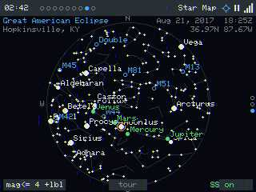 |
| *A saved **memory sky** — the exact sky over Hopkinsville, KY at 18:25 UTC on 21 Aug 2017, the moment of greatest eclipse, with the Sun (note the corona ring), Regulus right beside it, and the planets strung along the ecliptic, recreated on the device.* |

---

## What is this?

**Overhead** turns a cheap ESP32 "Cheap Yellow Display" (CYD) into a glanceable
observation deck for everything happening above you — **right now, from where you
are.** Satellites passing overhead, rockets about to launch, aircraft on approach,
aviation and space weather, the solar system, a live all-sky star map, and a
"tonight at a glance" agenda — all on a $10–15 touchscreen you can leave on a shelf.

It knows your location and the time, and an **Intelligent Focus** director quietly
surfaces the one thing worth looking at across all of those tabs: an ISS pass in
four minutes, a launch window opening, a geomagnetic storm, a thunderstorm rolling in.

### The heart of it

Beyond being the best little air-&-space *desk clock*, Overhead exists to **inspire
kids**. It puts the awe of far-away missions on a child's bedside table and makes it
*real*: space stops being abstract and becomes "look — the ISS goes over **our house**
in four minutes," "that rocket launches **tonight**," "this is the exact sky from the
night you were born." A glowing window to the cosmos, always on, always current.

## Why this instead of cloning a weather-station project?

Most CYD projects do one thing — a weather screen, a clock, a single gauge.
Overhead is a **modular multi-page application framework**:

- A **page carousel** + a **provider / scheduler / event-bus core** + a **cross-tab
  director** — not a single screen, but a whole dashboard you can extend.
- Engineered to **run real HTTPS data feeds on a no-PSRAM device** — the hard part
  most projects avoid. A serialized non-blocking network task, heap-floor-aware TLS
  (serve stale instead of crash), stale-data resilience, and a WiFi watchdog.
- A full **remote debug / automation API**: a `/remote` browser page that mirrors the
  live screen with click-to-tap and swipe, plus `/api/screen.jpg`, `/api/tap`,
  `/api/swipe`, `/api/status`, OTA — almost no hobby firmware ships this.

Versus the alternatives: phone apps (Heavens-Above, SkySafari) and desktop orreries
are great but they're *not always-on, glanceable, and sitting on your shelf*. Generic
CYD weather stations are single-purpose. Overhead is **always-on, location-aware,
multi-domain, on dedicated cheap hardware.**

> **Honest scope:** the astronomy is "good enough for a glanceable dashboard," not an
> observatory ephemeris (low-precision Schlyter orbits, ~arcminute). It's a window to
> wonder, not a telescope mount controller (though it could drive one — see the backlog).

---

## Feature tour

Eight tabs — swipe left/right between them. Most pages **cycle sub-views on a centre
tap**; **up/down swipe** scrolls a list or steps sub-views; **side taps** step items
(a satellite, an aircraft, a launch). Tap the status strip to toggle **AUTO / MANUAL**;
long-press to **pin**.

### 0 · Agenda — *your night at a glance*

| |
|---|
| 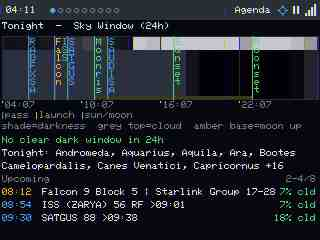 |
| The **Sky Window**: a 24 h timeline that shades day → civil → nautical → astronomical darkness, paints a cloud-cover heat band across the top of each hour and a moon-up band along the bottom, and tick-marks every event with a legend. Underneath: the **clear-&-dark verdict** ("Clear & dark 02:35–04:35"), a **tonight's-sky** line of the naked-eye planets and the constellations with ≥3 stars up during the darkest hour (it even calls out an active meteor shower's ZHR), and a scrollable **Upcoming** list with cloud-% coloured per event. **Tap any event — in the timeline or the list — to jump straight to its tab and focus that exact item.** |

### 1 · Launches — *what's going up*

| |
|---|
| 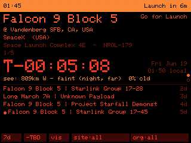 |
| The next launch: provider, vehicle, mission, pad, country, a colour-coded **status pill** (Go / Hold / TBD), and a big `T-` countdown — precise launches tick `T-HH:MM:SS`, vague ones show `~ MMM DD`. The line **"see: 809 km W — faint (night, far)"** is the **visibility verdict**: Overhead works out whether *you* could see the launch (twilight-plume geometry, distance, cloud) and rates it likely / faint / unlikely. *(This frame also caught the Director's **"Launch in 6m"** interrupt banner in the status strip — the cross-tab alert in action.)* |

| |
|---|
| 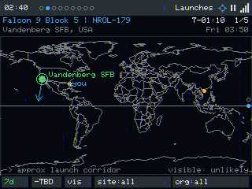 |
| The **Map** (centre-tap toggles to it): a world map with a marker at every upcoming launch site. The selected pad gets a ring and a **launch-corridor azimuth arrow**, and a sight-line from your crosshair coloured by the visibility verdict. Side-tap steps launches; bottom chips filter by **time window** (24 h / 7 d / 30 d / all), **hide-TBD**, **visible-only**, **site**, and **provider**. |

### 2 · Aircraft — *who's overhead right now*

| |
|---|
| 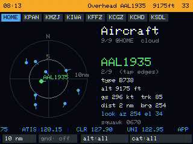 |
| A north-up **ADS-B radar** with range rings (your range + 5/10 nm reference), per-blip **heading chevrons**, and **dead-reckoned** motion between updates. Tap a blip → callsign, type, altitude, ground speed + track, distance/bearing, and the **look az/el** (where to point binoculars). An **emergency squawk** (7700/7600/7500) rings the contact and raises a banner; HOME + airport chips recenter the radar; chips filter range / on-ground / altitude / category; a marquee scrolls the **nearest airport + its frequencies**. *(Shown at a quiet field — and note a real limit: on a no-PSRAM board the live ADS-B fetch competes with the screenshot buffer for heap, so a busy radar is hard to **screenshot** even when it's lively on the glass — see Limitations.)* |

### 3 · Aviation weather — *the sky's flight briefing*

| |
|---|
| 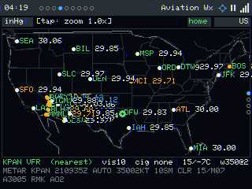 |
| **Map** — airports coloured by flight category (VFR green / MVFR cyan / IFR-LIFR orange), with **wind barbs**, id labels, an observer crosshair, and tappable zoom. Side-tap steps fields; centre-tap cycles views. |

| |
|---|
| 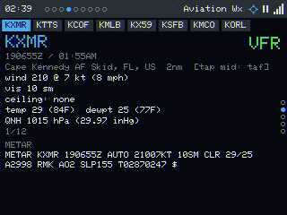 |
| **METAR** — a fully decoded card: Zulu + local obs time, wind (kt + mph), visibility, ceiling, temp/dewpoint (°C + °F), QNH (hPa + inHg), present-weather, and the raw text. Station chips jump between nearby fields. |

| |
|---|
| 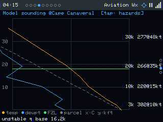 |
| **Sounding** — a Skew-T model profile: temperature + dewpoint vs altitude, the **freezing level**, **winds aloft** at 3/10/20/30 kft, a dashed dry-parcel line, and a soaring **stability analysis** (cloud base / top-of-lift / inversion). |

| |
|---|
| 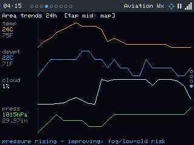 |
| **Trends** — 24 h area sparklines for temp / dewpoint / cloud / pressure with a plain-language conclusion ("pressure steady", "+ fog/low-cld risk", "clearing"). |

| |
|---|
| 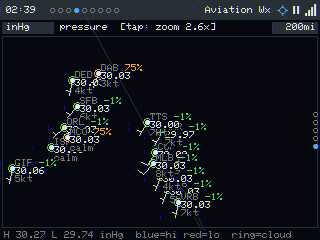 |
| **Pressure** — a makeshift synoptic map from major-airport METARs: H/L markers, blue-high/red-low colouring, cloud rings, hPa/inHg/cloud modes, and **tap-to-zoom levels** (off / 2.6× / 4.5× / 7×) that bring in wind barbs. |

Two more views appear **only when there's data**: a **TAF** view (decoded FM/BECMG/TEMPO/PROB
periods) when a field carries one, and a **Hazards** view (AIRMET/SIGMET/PIREP in plain
language) when an advisory is nearby. When there isn't, they drop out of the carousel —
and a hazard or **newly-forecast extreme weather** (thunderstorms, hail, heavy precip,
strong wind) is surfaced cross-tab as a notice instead (see the Director).

### 4 · Satellites — *catch the pass*

| |
|---|
| 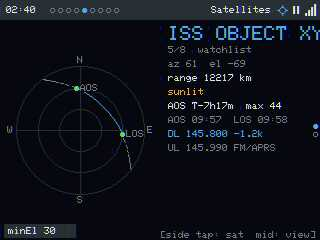 |
| **Polar** — a sky-dome with the predicted **pass-trajectory arc** (solid above your min-elevation, dashed below), AOS/LOS markers + times, max elevation, sunlit-vs-eclipsed flag, live range, and — for FM birds — **live Doppler** uplink/downlink ("DL 145.800 −1.2k"). Counts down "AOS T-7h17m max 44°". |

| |
|---|
| 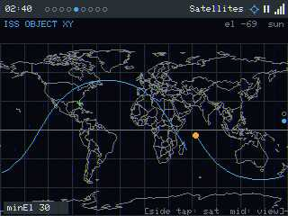 |
| **Ground** — the world **ground track** for ~one orbit, the sub-satellite point (sunlit/eclipsed), the day/night-aware subsolar marker, and your location. Side-tap steps your watchlist; a chip cycles the **min-elevation filter**. Passes use SGP4 from cached TLEs — so it **works offline**. |

### 5 · Space weather — *is the Sun acting up?*

| |
|---|
| 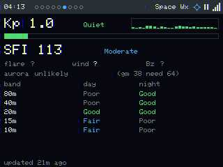 |
| A **Kp** gauge + a 3-day history sparkline, the solar flux index, GOES **X-ray flare class** (C/M/X), **solar-wind speed** and **IMF Bz**, an **aurora-chance** read for your own geomagnetic latitude (it computes the auroral-oval boundary from Kp), and an HF **band-conditions** table (80–10 m, day/night) from an SFI+Kp heuristic. |

### 6 · Solar System — *the neighbourhood tour*

| |
|---|
| 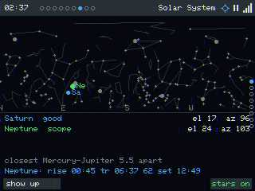 |
| **Sky-dome** — Sun/Moon/planets by az/el on a horizon dome, each with a **naked-eye visibility rating** (easy/twilight/washed/scope), rise/transit/set, the closest **conjunction** when bodies are <5° apart, and an optional constellation-line star overlay. |

| |
|---|
| 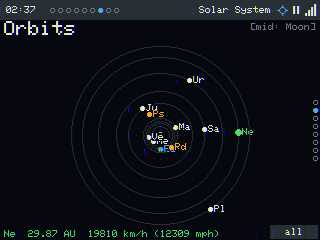 |
| **Orbits** — a top-down **orrery** at live heliocentric longitudes (√-scaled rings so Mercury isn't crushed by Pluto), with minor bodies/Starman, and each body's **orbital speed around the Sun in km/h and mph**. |

| |
|---|
| 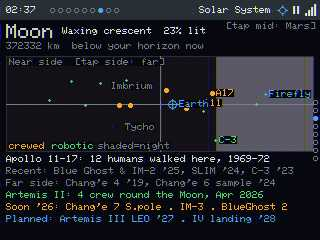 |
| **Moon** — phase + illumination %, distance, and **near/far-side maps** with Apollo crewed, robotic, and 2024+ CLPS **landing sites**, plus the sub-Earth/sub-solar points. |

| |
|---|
| 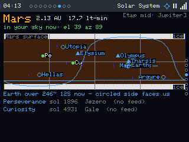 |
| **Mars** — distance + light-time, a surface map with polar caps and Olympus/Marineris, the sub-Earth circle, and **rover sols** (Perseverance/Curiosity) with status. |

| |
|---|
| 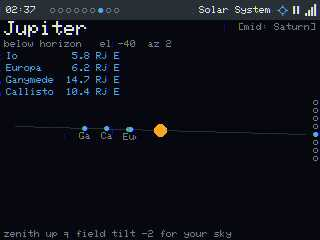 |
| **Jupiter** — the four Galilean moons strung along the equator in Jupiter-radii, with the whole system **tilted by the parallactic angle to match your sky** ("field tilt N° for your sky"). |

| |
|---|
| 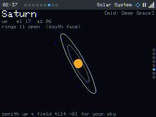 |
| **Saturn** — the disk + rings with the live **opening angle** ("rings 26° open, north face") and a Cassini-division hint, also tilted to your sky. |

| |
|---|
| 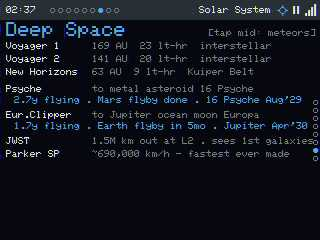 |
| **Deep Space** — Voyager 1/2 & New Horizons distances in AU + light-hours, plus in-flight missions (Psyche, Europa Clipper, JWST, Parker). |

| |
|---|
| 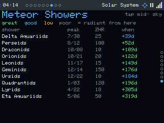 |
| **Meteor showers** — upcoming showers in date order with ZHR, days-to-peak, and a **radiant-quality** rating from your latitude (great/good/low/poor); active showers flagged "NOW". |

### 7 · Star Map — *the whole sky, and the night you remember*

| |
|---|
| 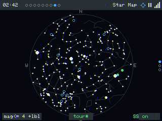 |
| **Full sky** — an all-sky azimuthal chart from a real generated catalogue (HYG + d3-celestial): ~1500 stars, all 88 **constellation figures**, Messier **deep-sky markers**, the ecliptic, and the Sun (a small **corona ring** so it reads clearly without washing out the chart)/Moon/planets. |

| |
|---|
| 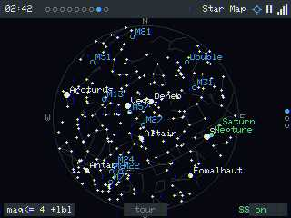 |
| **Tap to zoom** — tap any region and it magnifies: fainter stars fade in and star + constellation names appear, with a centre az/el readout. |

| |
|---|
|  |
| **Tour** — a badge auto-zooms each above-horizon constellation in turn (here, Andromeda), naming its stars, then moves on. Bottom badges cycle the **magnitude limit** and toggle the Sun/planets overlay + the tour. |

| |
|---|
|  |
| **Memory skies** — save "the sky at *this moment* from *this place*" (a birthday, an eclipse) and it renders the **full** sky for that exact instant and lat/lon, captioned title + place (top-left) and date + coordinates (top-right). **Swipe up/down to cycle** between the live sky and your saved skies — the **view dots on the right edge** show where you are. Add/edit them in the web UI's **Memory Skies** tab. |

| |
|---|
| 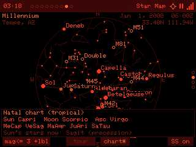 |
| **Natal chart** — on a memory sky, the **chart** chip overlays the real computed **Sun / Moon / Ascendant** + planets in their (tropical) signs, plus the honest twist only an astronomy device can add: the **Sun's actual constellation** right now ("Sun's stars now: Sagittarius") — which differs from the astrological sign because of precession. Astronomy first, with astrology as the cultural lens. |

### 8 · Device Health — *under the hood*

| |
|---|
| 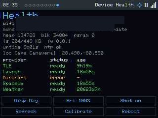 |
| The system table (WiFi, heap + **largest-block low-water** + **httpsSkip**, filesystem, uptime, location) and per-provider **status + age in d/h/m/s**, plus on-device controls: cycle the display palette (Auto/Day/Night/Red) and brightness, toggle remote screenshots, toggle the **Web** server (off frees ~35 KB of contiguous heap for the feeds — it boots off by default and re-enables here or via the serial console), **Refresh** all providers, **Recalibrate** touch, and a two-tap **Reboot**. *(WiFi SSID and LAN IP boxed out here.)* |

---

## Cross-cutting features

These have no single tab — they're part of the whole experience.

| |
|---|
|  |
| **Clock-mode overlay** — tap the time and a big clock stamps over the live page (static lower-right on data pages, corner-hopping on calm ones for burn-in); chips toggle 24 h/AM-PM and digital/analog, with a date complication. |

| |
|---|
| 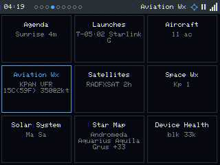 |
| **3×3 quick-jump grid** — tap the page dots and every tile shows a live micro-status (next launch T-, ISS AOS, nearest METAR, Kp, constellations up…); tap a badged tile to land on its alert. |

| |
|---|
|  |
| **Day / Night / Red dark-adapt themes** — auto by sun altitude or forced from Health; the red palette preserves night vision at the eyepiece. *(Shown here on a memory sky.)* |

- **Intelligent Focus director** — the cross-tab brain. An ambient resting tab by
  day/night with a multi-page attract tour; **interrupts** that seize focus for an
  imminent **pass** ("ISS 45° in 3m · VIS") or **launch** ("Launch in 6m" — *the
  Launches shot above*); and **notice badges** for Kp storms, aviation SPECIs, hazards,
  and extreme weather. In AUTO it switches the carousel (with a brief **"▸ page"**
  banner) and pre-focuses the exact item; in MANUAL it just badges the tab. A *new*
  severe condition fires a one-shot cross-tab alert so a dangerous change gets noticed.
- **Modes & status-strip chrome** — AUTO / MANUAL / pinned. The right cluster is icons:
  **WiFi signal bars** (tap → Health), a **mode glyph** (play/pause/lock), and a
  **location crosshair** that opens an on-device **saved-locations picker**.
- **Offline field mode** — boot with no WiFi and **tap past the captive portal** to run
  on cached data (satellite passes, star map, orrery, agenda all work offline); the
  WiFi-down reboot watchdog is suppressed and the last-known location is reused.
- **Provisioning** — WiFiManager captive portal on first boot; IP geolocation; NTP/RTC.

### Web / remote interface

- **`/remote`** — a live screen mirror in your browser with click-to-tap and swipe
  buttons. Control your desk clock from a laptop.
- **`/`** — a tabbed settings app: Location (Leaflet map + address geocode + "My
  location" + saved locations), Focus (per-page day/night tour checkboxes), Satellites &
  Bodies pickers, **Memory Skies** (map picker), Appearance, Aircraft, System.
- **`/update`** — ElegantOTA firmware upload. **`/api/status`** — JSON health/telemetry.
- Helper scripts: `scripts/ota.ps1` (flash over WiFi) and `scripts/shot.ps1` (screenshot).

### Reliability on a $12 no-PSRAM board

This is the real engineering story (and a genuine differentiator): a single serialized
non-blocking network task so only one TLS session ever exists; **heap-floor-aware TLS**
that serves stale data instead of running out of memory and crashing; stale-data release
to keep the heap clear; a **WiFi watchdog** that reconnects and, if needed, reboots; and
live memory-pressure telemetry (`heapBlkMin`, `httpsSkip`) you can watch in `/api/status`.

---

## Build one

It runs on a **$10–15 ESP32 "Cheap Yellow Display."** The full bill of materials,
toolchain setup, first flash, WiFi provisioning, OTA, and board-specific quirks live in
**[HARDWARE_SETUP.md](HARDWARE_SETUP.md)**.

Quick version: install PlatformIO, `git clone`, build the `cyd28_ili9341` env, flash over
USB once, then join the `Overhead-Setup-…` WiFi to provision. After that, OTA from your
desk.

---

## Technical challenges — overcome & still open

**Overcome** (details in [CYD-ESP32-2432S028R.md](CYD-ESP32-2432S028R.md) and
[PIO_DEBUG.md](PIO_DEBUG.md)):
- Running real HTTPS feeds on a **no-PSRAM** board — the ~42 KB contiguous-TLS floor; a
  serialized non-blocking net task; serve-stale-instead-of-OOM.
- The **JPEG screenshot colour readback** — empirically-derived byte-swap +
  hi5=B/mid6=R/lo5=G, written B,G,R for JPEGENC.
- Backlight via **direct LEDC** (LovyanGFX's `Light_PWM` didn't drive GPIO21).
- **Un-mirroring** the panel (MV=0 rotation 6) and matching touch calibration.
- Anti-flicker without a framebuffer (`startWrite` batching + redraw-on-change).
- The **stale-data starvation loop** (retained data pinned the heap floor) and its fix.
- Observer-relative astronomy: parallactic-angle planet tilt, pass-trajectory arcs.

**Still open / known limits** — candid, because it builds trust:
- The TLS floor still starves fetches when `heapBlkMin` dips (can't shrink mbedtls
  buffers on the precompiled classic platform). The **live ADS-B feed** is the most
  affected — it clears and re-fetches contacts frequently, and the 16 KB screenshot
  buffer eats the headroom it needs, so a busy radar is hard to *screenshot*. **Flash is
  ~99 % full** on the classic env.
- OTA flakes under AsyncTCP load (boot-settle ~20 s and retry); occasional WiFi drops
  (now watchdog-recovered).
- Schlyter astronomy is ~arcminute, not an ephemeris; data caps (TLE watchlist-only,
  aircraft 24, METAR 12); flicker on dense full-redraw pages.

---

## What's next (highlights)

A few of the juicier backlog items: **az/el rotor output** (drive a real or DIY antenna rotator) and an
**IMU handheld antenna-aim** mode; externalising the orrery body list to LittleFS (comets,
NEOs, dwarf planets); Saturn's moons; true WPC surface fronts (blocked on a data source);
aircraft flight trails; rover/APOD imagery on PSRAM boards; on-device watchlist editing;
banner + buzzer alerts; and verifying the 4" and ESP32-S3 hardware targets.

The complete, living list is in **[BACKLOG.md](BACKLOG.md)**.

---

## Status / license / credits

Active, single-developer project; the 2.8" CYD (`cyd28_ili9341`) is the verified target.

**License: [PolyForm Noncommercial 1.0.0](LICENSE).** Free for personal, hobby,
educational and research use — clone it, build it, run it, modify and share it. **Any
commercial use or reselling — of this or derivatives — needs written permission.** See
[LICENSE](LICENSE).

Built on excellent open-source libraries, each under its own license: **LovyanGFX**,
**ArduinoJson**, **Hopperpop SGP4**, **JPEGENC** (bitbank2), **ElegantOTA**,
**ESPAsyncWebServer** / **AsyncTCP**, **WiFiManager**. Data from NOAA SWPC & the Aviation
Weather Center, Open-Meteo, ip-api, Launch Library 2, CelesTrak, the HYG database,
d3-celestial, and Natural Earth.

*73 de KE7AQA.*
